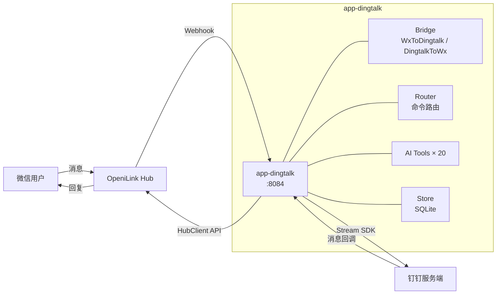

# @openilink/app-dingtalk

[](LICENSE)
[](https://www.typescriptlang.org/)
[](Dockerfile)

**微信 ↔ 钉钉双向消息桥接 + 20 个 AI Tools** — 消息、通讯录、日程、待办、审批、考勤、钉盘全覆盖。

> 本项目是 [OpeniLink Hub](https://github.com/openilink/openilink-hub) 的官方 App。Hub 是开源的微信 Bot 管理平台 + App 应用市场。

## 功能亮点

- **IM 双向桥接** — 微信消息实时转发到钉钉群/个人，钉钉回复自动回传微信
- **Stream 模式** — 基于钉钉 Stream SDK，无需公网 IP 和域名，内网即可运行
- **20 个 AI Tools** — 覆盖消息发送、通讯录查询、日程管理、待办任务、审批流程、考勤打卡、钉盘文件
- **SQLite 持久化** — 安装信息和消息映射关系本地存储，零外部依赖
- **Docker 一键部署** — 多阶段构建，镜像轻量

## 使用方式

安装到 Bot 后，支持三种方式调用：

### 自然语言（推荐）

直接用微信跟 Bot 对话，Hub AI 会自动识别意图并调用对应功能：

- "给张三发条钉钉说明天放假"
- "查一下钉钉上的审批"

### 命令调用

使用 `/命令名 参数` 的格式直接调用：

- `/send_dingtalk_message --user_id xxx --text 你好`

### AI 自动调用

Hub AI 在多轮对话中会自动判断是否需要调用本 App 的功能，无需手动触发。

## AI Tools（20 个）

### 消息 (Messaging) — 5 个

| 工具名 | 说明 |
|--------|------|
| `send_text_message` | 发送文本消息到钉钉用户 |
| `send_markdown_message` | 发送 Markdown 消息到钉钉用户 |
| `reply_text` | 通过 sessionWebhook 回复文本 |
| `reply_markdown` | 通过 sessionWebhook 回复 Markdown |
| `send_group_message` | 发送消息到钉钉群 |

### 通讯录 (Contacts) — 3 个

| 工具名 | 说明 |
|--------|------|
| `search_user` | 按关键词搜索钉钉用户 |
| `get_user_info` | 获取用户详细信息 |
| `get_department_users` | 获取部门成员列表 |

### 日程 (Calendar) — 3 个

| 工具名 | 说明 |
|--------|------|
| `create_event` | 创建日程事件 |
| `list_events` | 查询日程列表 |
| `delete_event` | 删除日程事件 |

### 待办 (Todo) — 3 个

| 工具名 | 说明 |
|--------|------|
| `create_todo` | 创建待办任务 |
| `list_todos` | 获取待办列表 |
| `update_todo` | 更新待办状态 |

### 审批 (Workflow) — 2 个

| 工具名 | 说明 |
|--------|------|
| `get_process_instance` | 查询审批实例详情 |
| `list_process_instances` | 获取审批实例列表 |

### 考勤 (Attendance) — 2 个

| 工具名 | 说明 |
|--------|------|
| `get_attendance_record` | 查询考勤打卡记录 |
| `get_attendance_summary` | 获取考勤统计汇总 |

### 钉盘 (Drive) — 2 个

| 工具名 | 说明 |
|--------|------|
| `list_files` | 列出钉盘文件 |
| `get_file_info` | 获取文件详情和下载链接 |

## 快速开始 — 应用市场一键安装

1. 打开 [OpeniLink Hub](https://github.com/openilink/openilink-hub) 管理后台
2. 进入 **应用市场**，找到 **钉钉桥接**
3. 点击 **安装**，按提示填入钉钉 AppKey / AppSecret / RobotCode
4. 安装完成后即可在微信中使用

<details>
<summary><strong>自部署 — Docker</strong></summary>

```bash
# 使用 docker-compose
docker-compose up -d

# 或直接 docker run
docker build -t openilink-app-dingtalk .
docker run -d \
  -p 8084:8084 \
  -e HUB_URL=https://your-hub.example.com \
  -e BASE_URL=https://your-app.example.com \
  -e DINGTALK_CLIENT_ID=your-app-key \
  -e DINGTALK_CLIENT_SECRET=your-app-secret \
  -e DINGTALK_ROBOT_CODE=your-robot-code \
  -v dingtalk-data:/data \
  openilink-app-dingtalk
```

或源码运行：

```bash
git clone https://github.com/openilink/openilink-app-dingtalk.git
cd openilink-app-dingtalk
npm install
cp .env.example .env   # 编辑 .env 填入实际值
npm run dev             # 开发模式
npm run build && npm start  # 生产模式
```

</details>

<details>
<summary><strong>环境变量</strong></summary>

| 变量名 | 必填 | 默认值 | 说明 |
|--------|------|--------|------|
| `HUB_URL` | 是 | — | OpeniLink Hub 地址 |
| `BASE_URL` | 是 | — | 本应用对外可访问的基础 URL |
| `DINGTALK_CLIENT_ID` | 是 | — | 钉钉应用 AppKey |
| `DINGTALK_CLIENT_SECRET` | 是 | — | 钉钉应用 AppSecret |
| `DINGTALK_ROBOT_CODE` | 否 | `""` | 钉钉机器人 Code（用于主动发消息） |
| `PORT` | 否 | `8084` | HTTP 服务端口 |
| `DB_PATH` | 否 | `data/dingtalk.db` | SQLite 数据库路径 |

</details>

<details>
<summary><strong>钉钉应用配置指南</strong></summary>

### 创建钉钉应用

1. 登录 [钉钉开放平台](https://open-dev.dingtalk.com/)
2. 创建企业内部应用（H5 微应用）
3. 进入 **凭证与基础信息**，获取 **AppKey**（即 ClientID）和 **AppSecret**（即 ClientSecret）
4. 进入 **机器人与消息推送**，开启机器人功能，记录 **RobotCode**
5. 进入 **Stream 模式**，开启 Stream 推送（无需配置回调地址）

### 配置权限

在钉钉应用管理后台，添加以下 API 权限：

- 企业内机器人发送消息
- 通讯录只读权限
- 日程读写权限
- 待办读写权限
- 审批只读权限
- 考勤只读权限
- 钉盘只读权限

### Stream 模式说明

钉钉 Stream 模式通过 WebSocket 长连接接收事件推送，无需暴露公网回调地址。本应用使用 `dingtalk-stream-sdk-nodejs` 与钉钉服务端建立连接。

### 必要配置步骤

1. **创建应用**：在钉钉开放平台创建企业内部应用
2. **获取凭证**：记录 AppKey 和 AppSecret
3. **开启机器人**：在"机器人与消息推送"中启用，获取 RobotCode
4. **启用 Stream**：在"Stream 模式"中开启推送
5. **配置权限**：根据需要的 Tools 功能添加对应 API 权限
6. **发布应用**：在应用管理中发布到企业内部

### 事件订阅

Stream 模式下自动订阅以下事件：

- 机器人收到消息
- 机器人被添加到群
- 机器人被移出群

</details>

<details>
<summary><strong>开发指南</strong></summary>

### 架构



### 消息流转

**自动桥接模式** — 微信用户发送消息后，Hub 推送 Webhook 到本应用，`WxToDingtalk` 将消息格式化为 Markdown 转发到对应的钉钉会话。钉钉用户回复后，Stream 回调触发 `DingtalkToWx` 通过 HubClient 将回复回传到微信。

**自然语言模式** — Hub 解析用户意图后，调用对应的 AI Tool（如 `create_todo`、`search_user`），由本应用通过钉钉 API 执行操作并返回结果。

**命令模式** — 以 `/` 开头的消息被路由到 `Router`，由注册的命令处理器处理（如 `/help`、`/bind`、`/status`）。

</details>

## 安全与隐私

- **消息内容不落盘** — 消息内容仅在内存中中转，不会存储到数据库或磁盘
- **仅保存消息 ID 映射** — 数据库中只保存消息 ID 对应关系（用于回复路由），不保存消息正文
- **用户数据严格隔离** — 所有查询均按 `installation_id` + `user_id` 双重过滤，不同用户之间完全隔离
- **应用市场安装（托管模式）** — 不会记录、存储或分析用户的消息内容；所有代码完全开源，接受社区审查
- **自部署** — 如需更高隐私保障，可自行部署，所有数据仅在您自己的服务器上流转

## License

MIT
